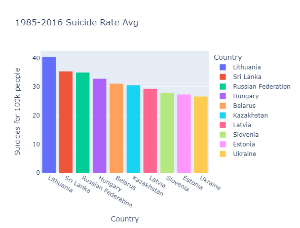
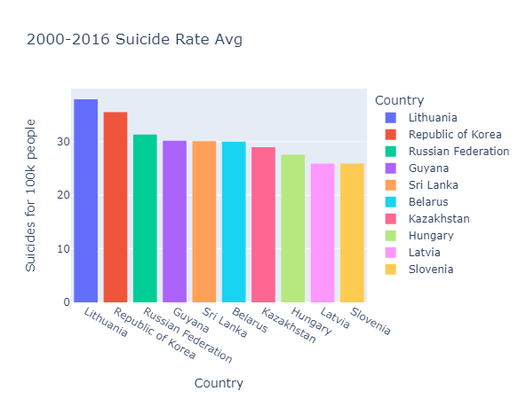
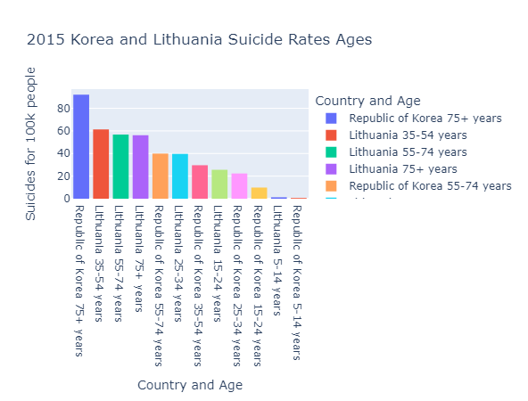
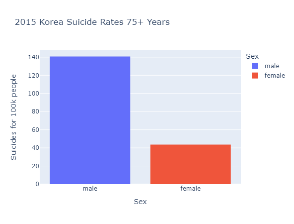

# Overview

In this project I set myself the challenge to find a relevant dataset and analyze it through the use of python and the pandas library. This is to test my skills and grow as a programmer. Analyzing this dataset has given me insight in data science, how to analyze data and how to continue forward for my growth.

The dataset in question its one on suicide from 1985-2016 obtained in Kaggle, it is the most downloaded one on the subject. It is also a really clean and useful dataset, making it easier to analyze for my purposes. Some of the important features are country-year, age range, number of suicides, percentage of suicides, HDI, GDP and generation. It contains almost 28k rows of data, so its a fairly small dataset.
[Dataset](https://www.kaggle.com/datasets/russellyates88/suicide-rates-overview-1985-to-2016)

I chose this topic due to personal interest on the subject. This will help me personally and give me a deeper understanding on what factors are in suicide.

Code walkthrough:
[Suicide Analysis](https://youtu.be/vLNL-pLiTD0)

# Data Analysis Results

## Question 1: Who has the highest suicide risk?
Here its a pretty simple question that is quite common on the subject. The answer, men that live in South Korea and have an age of 75 or more. Now let's walk through how I found this out.

First I got the average of suicide rate from 1985-2016 and then from 2000-2016, filtering to the top 10 and noticed the changes. Lithuania stays first, but South Korea moves up to second place overall.



Now after that I wanted to compare the top 2, Lithuania and South Korea. I compared them breaking it down to ages. Here we can notice that out of all the groups people of South Korea with 75+ years are more likely to commit suicide.


Now we break it down to sex, and by a majority men are the ones who commit suicide more in the age group. Out of 100k people 140 of the target group commit suicide in 2015.


This is what drew me to the conclution that men of South Korea of 75+ years are the ones that are at higher risk of suicide. This can be due to people in general feeling more lonely as they age and loneliness in advanced age being more of a problem.

## Question 2: Does quality of life factor in suicide?
For this, I wondered if a better quality of life of a country would lower the suicide rate and thus I set myself to analyze this with the dataset. The results are clear, on average a better HDI and GDP lead to more suicides. This is not what I expected to happen, but first what is HDI and GDP?

The HDI of a country is a composite measure of the country's achievements in health, knowledge and standard of living. Meaning there is better education, more hospitals, and in general people live better overall. Now, here we are comparing the 30 countries with the least HDI and the 30 countries with the most HDI. From both averages there is an increase of the 63.68% of more suicides in the top countries.
```
# Average HDI for country compared to suicide rate top 30 HDI
# Group by country, average HDI and suicide rate
df4 = df.groupby("country")[["HDI for year", "suicides/100k pop"]].mean().reset_index()
df4 = df4.sort_values("HDI for year", ascending=False).head(30)
print(f"(30 Top HDI)Suicides per 100k pop:{round(df4["suicides/100k pop"].mean(), 2)}")

# Average HDI for country compared to suicide rate last 30 HDI
# Group by country, average HDI and suicide rate
df5 = df.groupby("country")[["HDI for year", "suicides/100k pop"]].mean().reset_index()
df5 = df5.sort_values("HDI for year", ascending=True).head(30)
print(f"(30 Last HDI)Suicides per 100k pop:{round(df5["suicides/100k pop"].mean(), 2)}")
print(f"Top 30 is an increase of {round(df4["suicides/100k pop"].mean() / df5["suicides/100k pop"].mean() * 100 - 100, 2)}%")
```
```
--Returns--
(30 Top HDI)Suicides per 100k pop:14.24
(30 Last HDI)Suicides per 100k pop:8.7
Top 30 is an increase of 63.68
```

The GDP per capita of a country is a measure of the economic output of average of every single person. It basically determines the economic power of a nation. The GDP follows the same trend as the HDI in suicide rates going up in general with 12.56% more suicides on average on the top 30 GDP countries.
```
# Average GDP for country compared to suicide rate top 30 GDP
# Group by country, average gdp and suicide rate
df6 = df.groupby("country")[["gdp_per_capita ($)", "suicides/100k pop"]].mean().reset_index()
df6 = df6.sort_values("gdp_per_capita ($)", ascending=False).head(30)
print(f"(30 Top GDP)Suicides per 100k pop:{round(df6["suicides/100k pop"].mean(), 2)}")

# Average GDP for country compared to suicide rate last 30 GDP
# Group by country, average gdp and suicide rate
df7 = df.groupby("country")[["gdp_per_capita ($)", "suicides/100k pop"]].mean().reset_index()
df7 = df7.sort_values("gdp_per_capita ($)", ascending=True).head(30)
print(f"(30 Last GDP)Suicides per 100k pop:{round(df7["suicides/100k pop"].mean(), 2)}")
print(f"Top 30 is an increase of {round(df6["suicides/100k pop"].mean() / df7["suicides/100k pop"].mean() * 100 - 100, 2)}%")
```
```
--Returns--
(30 Top GDP)Suicides per 100k pop:12.19
(30 Last GDP)Suicides per 100k pop:10.83
Top 30 is an increase of 12.56%
```

This is why I conclude that the quality of life in a country does factor to suicide, and it factors negatively on it. There may be a number of reasons of why this is, maybe a different focus in culture or less societal unity.

# Development Environment

* Python 3.12.3
* Visual Code Studio 1.89
* Pandas Library
* Plotly Express Library
* Jupyter VSCode Extension
* Jupyter Cell Tags VSCode Extension
* Jupyter Keymap VSCode Extension

# Useful Websites

* [Kaggle](https://www.kaggle.com/datasets/russellyates88/suicide-rates-overview-1985-to-2016)
* [Pandas Tutorial W3school](https://www.w3schools.com/python/pandas/default.asp)
* [Plotly Express Page](https://plotly.com/python/plotly-express/)

# Future Work

* Cross reference data with other datasets.
* Utilize other datasets to include missing countries.
* Item 3